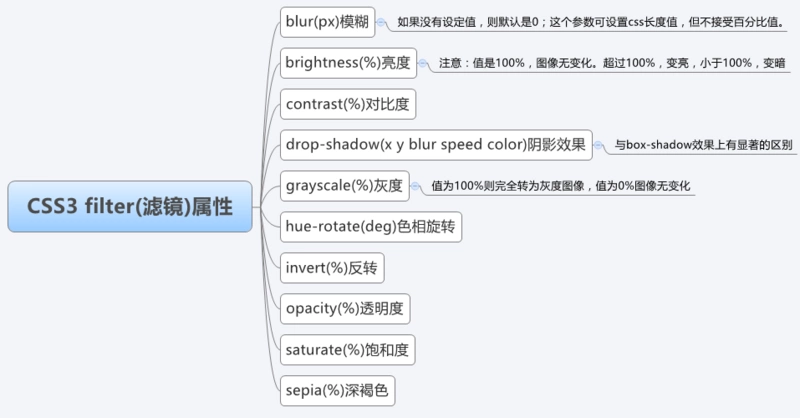

# CSS3  

## Flex & Grid

**Flex**是Flexible Box的缩写，翻译成中文就是“弹性盒子”，用来为盒装模型提供最大的灵活性。任何一个容器都可以指定为Flex布局。  
```css
.box{
    display: -webkit-flex; /*在webkit内核的浏览器上使用要加前缀*/
    display: flex; //将对象作为弹性伸缩盒显示
}
```
当然，行内元素也可以使用Flex布局。
```css
.box {
    display: inline-flex; //将对象作为内联块级弹性伸缩盒显示
}
```
兼容性写法
```css
.box {
    display: flex || inline-flex;
}
```

采用Flex布局的元素，被称为Flex容器(flex container)，简称“容器”。其所有子元素自动成为容器成员，成为Flex项目(Flex item)，简称“项目”。  


容器默认存在两根主轴：水平方向主轴(main axis)和垂直方向交叉轴(cross axis)，默认项目按主轴排列。  
* main start/main end：主轴开始位置/结束位置
* cross start/cross end：交叉轴开始位置/结束位置
* main size/cross size：单个项目占据主轴/交叉轴的空间

<br/>

**CSS Grid（网格）布局**，是一个二维的基于网络的布局系统。Flexbox 的出现很大程度上改善了我们的布局方式，但它的目的是为了解决更简单的一维布局，而不是复杂的二维布局（实际上 Flexbox 和 Grid 能协同工作，而且配合得非常好）。Grid(网格) 布局是第一个专门为解决布局问题而创建的 CSS 模块。  

采用grid布局的元素，被称为grid容器(grid container)，简称“容器”。其所有直接子元素（直接子元素的子元素不包含在内）自动成为容器成员，称为grid项目(grid item)，简称“项目”。  


## filter
CSS filter (滤镜)主要是用来实现图像的各种特殊效果  




## reset.css & rem 

**reset.css**
样式重置的目的是减少浏览器的不一致性，例如line-height,margin,标题的font-size大小等等。样式重置经常在CSS框架中出现。  

**rem**  
Equal to the computed value of "font-size" on the root element  
rem是CSS3新增的相对长度单位，是指相对于根元素html的font-size计算值的大小。简单可理解为屏幕宽度的百分比。  
若 html{font-size: 16px}   则 12px/16px=.75rem  


## Transform & Animation

### Transform  

**CSS3 变换**  
使用CSS3 transform不会进行DOM操作，性能大大提高  
transform 主要包含  
* 旋转 rotate  
* 缩放 scale  
* 移动 translate  
* 扭曲 skew  

**CSS3 过渡**  
过渡是元素从一种样式逐渐改变为另一种样式的效果，也就是渐变  
`transition: 500ms all ease`  
ease: 缓入缓出

### Animation  
CSS3 动画  Animation 由三部分组成  
* 关键帧(@keyframes)  
* 动画属性  
* css属性  

animation 事件  
animationed 事件在 css动画完成后触发  

```css
 .code1 {
    width: 50px;
    height: 50px;
    margin-left: 100px;
    background: blue;
    -webkit-animation-name:'wobble';/*动画属性名，也就是我们前面keyframes定义的动画名*/
    -webkit-animation-duration: 10s;/*动画持续时间*/
    -webkit-animation-timing-function: ease-in-out; /*动画频率，和transition-timing-function是一样的*/
    -webkit-animation-delay: 2s;/*动画延迟时间*/
    -webkit-animation-iteration-count: 10;/*定义循环资料，infinite为无限次*/
    -webkit-animation-direction: alternate;/*定义动画方式*/
  }

```


