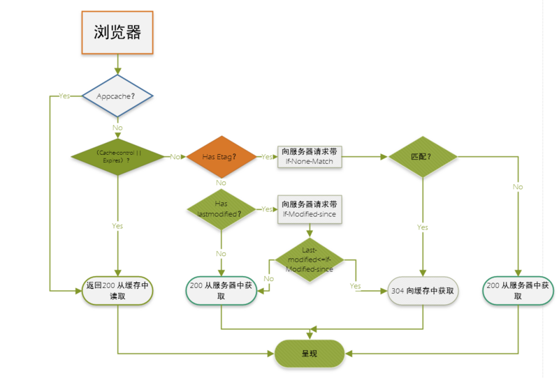

# 本地存储

作为一名前端工作人员，前端的缓存知识是必须掌握的，因为一个网站打开网页的速度直接关系到用户体验，用户粘度，而提高网页的打开速度有很多方面需要优化，其中比较重要的一点就是利用好缓存，缓存文件可以重复利用，还可以减少带宽，降低网络负荷。

缓存从宏观上分为私有缓存和共享缓存，共享缓存就是那些能被各级代理缓存的缓存。私有缓存就是用户专享的，各级代理不能缓存的缓存。

缓存从微观上可以分为以下几类：

* 浏览器缓存
* 代理服务器缓存
* CDN缓存
* 数据库缓存
* 应用层缓存

这里主要对浏览器的缓存进行说明：

## 1. HTTP缓存

**强缓存**

* 不会向服务器发送请求，直接从缓存中读取资源  
* 请求返回200的状态码  
* 在chrome控制台的network选项中可以看到size显示from disk cache或from memory cache。  

from memory cache代表使用内存中的缓存，from disk cache则代表使用的是硬盘中的缓存，浏览器读取缓存的顺序为memory –&gt; disk。  
在浏览器中，浏览器会在js和图片等文件解析执行后直接存入内存缓存中，那么当刷新页面时只需直接从内存缓存中读取\(from memory cache\)；  
而css文件则会存入硬盘文件中，所以每次渲染页面都需要从硬盘读取缓存\(from disk cache\)。

header信息  
1.Expires\(response header里的过期时间，浏览器再次加载资源时，如果在这个过期时间内，则命中强缓存\)

2.Cache-Control\(在HTTP1.1中，Cache-Control是重要的规则，主要用于控制网页缓存\)

> * max-age   
>
>   max-age=xxx\(xxx is numeric\)表示缓存内容将在xxx秒后失效  
>
> * no-cache  
>
>   客户端缓存内容，是否使用缓存则需要经过协商缓存来验证决定  
>
> * no-store  
>
>   所有内容都不会被缓存，既不实用强制缓存，也不使用协商缓存  
>
> * public  
>
>   所有内容都将被缓存，客户端和代理服务器都可缓存  
>
> * private  
>
>   所有内容只有客户端可以缓存  
>
> * s-maxage    
>
>   同max-age，只用于共享缓存\(比如cdn缓存\)  
>
>   max-age用于普通缓存，而s-maxage用于代理缓存

Expires和Cache-Control两者对比：其实这两者差别不大，区别就在于 Expires 是http1.0的产物，Cache-Control是http1.1的产物，两者同时存在的话，Cache-Control优先级高于Expires

**协商缓存**  
协商缓存就是强制缓存失效后，浏览器携带缓存标识向服务器发起请求，由服务器根据缓存标识决定是否使用缓存的过程

* 协商缓存生效，返回304和Not Modified  

header信息  
1.Last-Modified 和 If-Modified-Since  
浏览器在第一次访问资源时，服务器返回资源的同时，在response header中添加 Last-Modified的header，值是这个资源在服务器上的最后修改时间，浏览器接收后缓存文件和header

浏览器下一次请求这个资源，浏览器检测到有 Last-Modified这个header，于是添加If-Modified-Since这个header，值就是Last-Modified中的值；服务器再次收到这个资源请求，会根据 If-Modified-Since 中的值与服务器中这个资源的最后修改时间对比，如果没有变化，返回304和空的响应体，直接从缓存读取，如果If-Modified-Since的时间小于服务器中这个资源的最后修改时间，说明文件有更新，于是返回新的资源文件和200

缺点：

* 某些服务端不能获取精确的修改时间  
* 文件修改时间改了，但文件内容却没有变  

2.ETag 和 If-None-Match  
Etag是上一次加载资源时，服务器返回的response header，是对该资源的一种唯一标识，只要资源有变化，Etag就会重新生成。浏览器在下一次加载资源向服务器发送请求时，会将上一次返回的Etag值放到request header里的If-None-Match里，服务器只需要比较客户端传来的If-None-Match跟自己服务器上该资源的ETag是否一致，就能很好地判断资源相对客户端而言是否被修改过了。如果服务器发现ETag匹配不上，那么直接以常规GET 200回包形式将新的资源（当然也包括了新的ETag）发给客户端；如果ETag是一致的，则直接返回304知会客户端直接使用本地缓存即可。

**两种协商缓存方式对比**  
1.首先在精确度上，Etag要优于Last-Modified，Last-Modified的时间单位是秒，如果某个文件在1秒内改变了多次，那么他们的Last-Modified其实并没有体现出来修改，但是Etag每次都会改变确保了精度；如果是负载均衡的服务器，各个服务器生成的Last-Modified也有可能不一致。  
2.性能上，Etag要逊于Last-Modified，毕竟Last-Modified只需要记录时间，而Etag需要服务器通过算法来计算出一个hash值。  
3.优先级上，服务器校验优先考虑Etag

## 2. 缓存机制

## 3. 本地存储

### Cookie

Cookie主要是由服务器生成，且前端也可以设置，保存在客户端本地的一个文件，通过response响应头的set-Cookie字段进行设置，且Cookie的内容_自动在请求的时候被传递给服务器_。

> 使用document.cookie = "..." 获取和修改cookie

Cookie包含的信息：  
它可以记录你的用户ID、密码、浏览过的网页、停留的时间等信息。当你再次来到该网站时，网站通过读取Cookies，得知你的相关信息，就可以做出相应的动作，如在页面显示欢迎你的标语，或者让你不用输入ID、密码就直接登录等等。一个网站只能读取它自己放置的信息，不能读取其他网站的Cookie文件。因此，Cookie文件还保存了host属性，即网站的域名或ip。  
这些属性以键值对的方式进行保存，为了安全，它的内容大多进行了加密处理。  
Cookie文件的命名格式是：用户名@网站地址\[数字\].txt

Cookie的优点：

* 给用户更人性化的使用体验，如记住“密码功能”、老用户登录欢迎语  
* 弥补了HTTP无连接特性  
* 站点统计访问人数的一个依据  

Cookie的缺点：

* API需要封装才能用  
* 它无法解决多人共用一台电脑的问题，带来了不安全因素  
* Cookie文件容易被误删除  
* 一人使用多台电脑  
* Cookies欺骗。修改host文件，可以非法访问目标站点的Cookie  
* 容量有限制，不能超过4kb  
* 在请求头上带着数据安全性差  

### Storage

> 修改Storage键值对  
> localStorage.setItem\(key, value\);  
> localStorage.getItem\(key\);

**localStorage** localStorage主要是前端开发人员，在前端设置，一旦数据保存在本地后，就可以避免再向服务器请求数据，因此减少不必要的数据请求，减少数据在浏览器和服务器间不必要地来回传递。

可以长期存储数据，没有时间限制，一天，一年，两年甚至更长，数据都可以使用。 localStorage中一般浏览器支持的是5M大小，这个在不同的浏览器中localStorage会有所不同

优点：

* localStorage拓展了cookie的4k限制
* localStorage可以将第一次请求的5M大小数据直接存储到本地，相比于cookie可以节约带宽
* localStorage的使用也是遵循同源策略的，所以不同的网站直接是不能共用相同的localStorage

缺点：

* 需要手动删除，否则长期存在
* 浏览器大小不一，版本的支持也不一样
* localStorage只支持string类型的存储，JSON对象需要转换
* localStorage本质上是对字符串的读取，如果存储内容多的话会消耗内存空间，会导致页面变卡  

**sessionStorage**  
sessionStorage主要是前端开发人员，在前端设置，sessionStorage（会话存储），只有在浏览器被关闭之前使用，创建另一个页面时同意可以使用，关闭浏览器之后数据就会消失

存储上限限制：不同的浏览器存储的上限也不一样，但大多数浏览器把上限限制在5MB以下

> Cookie sessionStorage localStorage 的区别
>
> * 容量
> * 是否会携带到ajax中
> * API易用性

### IndexDB

随着浏览器的功能不断增强，越来越多的网站开始考虑，将大量数据储存在客户端，这样可以减少从服务器获取数据，直接从本地获取数据。

现有的浏览器数据储存方案，都不适合储存大量数据：Cookie 的大小不超过4KB，且每次请求都会发送回服务器；LocalStorage 在 2.5MB 到 10MB 之间（各家浏览器不同），而且不提供搜索功能，不能建立自定义的索引。所以，需要一种新的解决方案，这就是 IndexedDB 诞生的背景。

通俗地说，IndexedDB 就是浏览器提供的本地数据库，它可以被网页脚本创建和操作。IndexedDB 允许储存大量数据，提供查找接口，还能建立索引。这些都是 LocalStorage 所不具备的。就数据库类型而言，IndexedDB 不属于关系型数据库（不支持 SQL 查询语句），更接近 NoSQL 数据库。

