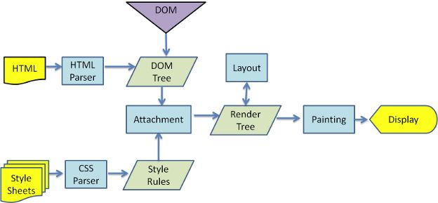
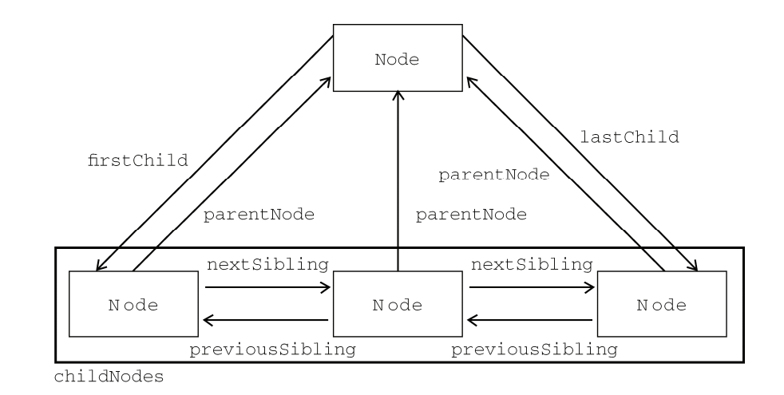

# 重绘/回流

**用户在浏览器地址栏输入网址，看到整个页面，中间都发生了哪些事情？**  
主要分为三个阶段

* HTTP请求阶段  
* HTTP响应阶段  
* 浏览器渲染阶段\(主要\)  

**浏览器加载一个资源的过程**  
1.浏览器根据DNS服务器得到该url\(域名\)的IP地址  
2.浏览器向这个IP地址发送请求  
3.服务器收到、处理并返回http请求  
4.浏览器得到返回的内容

**浏览器渲染阶段详细过程**  
1.拿到服务器的资源后，浏览器在内存中开辟一块栈内存，用来给代码提供环境；同时分配一个主线程去逐行解析和执行代码。  
2.当浏览器遇到link/script/img等标签的请求后，都会开辟全新的线程去**加载**资源文件。这个线程叫做TASK QUEUE任务队列\(涉及宏任务、微任务、Event Loop事件循环\)。  
3.当主线程第一次从上到下执行完后，只生成DOM树。然后等待任务队列里的任务请求完成，若有任务请求完成则执行该任务。当所有CSS处理完成后，生成CSSOM。  
4.将DOM树和CSSOM整合形成最终的RenderTree，并根据RenderTree进行渲染。  
5.如果有元素的样式或者浏览器的视口发生改变，触发重绘或者回流改变渲染树的结构，并重新渲染展示。

**浏览器渲染页面的过程**  
1.解析HTML结构生成DOM Tree，解析CSS生成 CSSOM树  
2.将DOM和CSSOM结合，生成渲染树\(RenderTree\)  
3.Layout\(布局\): 根据生成的渲染树，计算它们在设备视口\(viewport\)内确切的位置和大小，这个计算的阶段就是回流  
4.Painting\(绘制\): 根据渲染树以及回流得到的几何信息，得到节点的绝对像素  
5.Display: 将像素发送给GPU，展示在页面上



## DOM

DOM即\(Document Object Model\)文档对象模型。是 W3C（万维网联盟）的标准。是一种用于HTML和XML文档的编程接口。它给文档提供了一种结构化的表示方法，可以改变文档的内容和呈现方式。是中立于平台和语言的接口，它允许程序和脚本动态地访问和更新文档的内容、结构和样式。DOM属于浏览器，而不是JavaScript语言规范里的规定的核心内容。

DOM树都是节点\(node\)构成的  


DOM树的构建过程  
字节 -&gt; 字符 -&gt; 语义块 -&gt; 节点 -&gt; DOM

## 重绘/回流

**重绘**\(Repaint\)  
根据渲染树以及回流得到的几何信息，得到节点的绝对像素  
元素的样式改变会引起重绘\(但宽高、大小、位置等不算，这些改变了渲染树的会引起回流\)

> 如 outline visibility color background-color 等。

**回流**\(Reflow\)  
根据生成的渲染树，计算它们在设备视口\(viewport\)内确切的位置和大小，这个计算的阶段就是回流  
元素的大小或者位置发生了变化\(当页面布局和集合信息发生变化的时候\)，触发了重新布局，导致渲染树重新计算布局和渲染

> 如添加或删除可见的DOM元素\(不可见的不会在渲染树中\)  
> 元素位置发生变化  
> 元素的尺寸发生变化  
> 内容发生变化\(文本或者图片被另一个不同尺寸的图片所代替\)  
> 页面第一次渲染\(无法避免\)  
> 浏览器的窗口尺寸变化\(回流是根据视口的大小来计算元素的位置和大小的\)

**回流一定触发重绘，重绘不一定触发回流**

**前端性能优化 避免DOM回流**  
1.放弃传统的操作DOM时代，基于Vue/React开始数据影响视图模式

> mvvm / mvc / virtual dom / dom diff

2.分离读写操作\(现在的浏览器都有渲染队列的机制\)

> offsetTop / clientTop / scrollTop / getComputeStyle / currentStyle 会刷新队列

3.样式集中改变

```javascript
div.style.cssText = 'width:20px; height:20px;';
div.className = 'box';
```

4.缓存布局信息

```javascript
let curLeft = div.offsetLeft;
```

5.元素批量修改 文档碎片： createDocumentFragment 模板字符串拼接 `<li>${}<li>`

6.动画效果应用到position属性为absolute或fixed的元素上\(脱离文档流不引发回流\)

7.CSS硬件加速\(GPU加速\)

> 比起考虑减少回流重绘，更希望根本不回流重绘  
> transform / opacity / filters... 这些属性会触发硬件加速 ，不会引发回流和重绘  
> 但可能引起：过多占用内存，性能消耗严重，导致字体模糊

8.牺牲平滑度换取速度

9.避免使用table布局和使用css的js表达式

## Shadow DOM

Shadow DOM是HTML的一个规范 ，它允许浏览器开发者封装自己的HTML标签、CSS样式和特定的javascript代码，同时也可以让开发人员创建类似`<video>`这样的自定义一级标签，创建这些新标签内容和相关的的API被称为Web Component。

## 渲染阻塞

**css阻塞渲染**  
由于CSS决定了DOM元素的样式、布局，所以浏览器遇到CSS文件时会等待CSS文件加载并解析完后才继续渲染页面\(但不会阻止DOM树的构建\)。  
优化方案  
inline CSS：将那些页面首屏渲染需要用到的CSS代码加入Inline CSS  
推迟加载CSS： 对于那些首屏渲染不需要用到的CSS，我们可以依旧使用文件形式并在页面内容渲染完成后再加载。

**js阻塞渲染**  
当浏览器解析 script 标签时，由于浏览器并不知道js文件将会对页面做什么改变，有可能添加和删除DOM元素改变DOM树的结构，所以会先下载再执行js文件，最后再继续渲染。  
优化方案  
async: 不阻塞页面渲染，不保证执行顺序，谁先回来谁执行，不保证dom书构造完成之后再执行。  
defer: 不阻塞页面渲染, 保证执行顺序，保证dom树构造完成之后再执行。

```markup
<script type="text/javascript" src="page.js" async></script>
```

> **window.onload 和 DOMContentLoaded 的区别**  
> onload：页面全部加载完才会执行，包括样式文件、图片、视频等  
> DOMContentLoaded：DOM渲染完即可执行，此时样式、图片、视频可能还没有加载完

