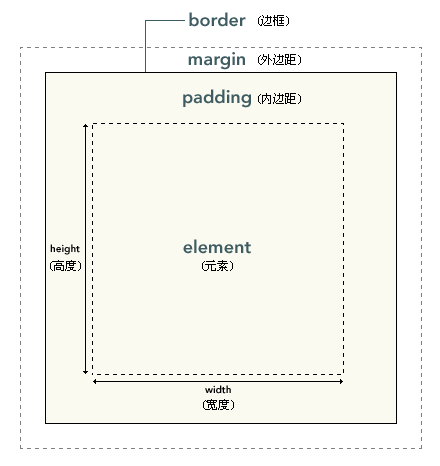

# 盒模型

CSS 盒模型 又称框模型 \(Box Model\) ，包含了元素内容（content）、内边距（padding）、边框（border）、外边距（margin）几个要素。

通常我们设置的背景显示区域，就是内容、内边距、边框这一块范围。而外边距margin是透明的，不会遮挡周边的其他元素。

元素框的总宽度 = 元素（element）的width + padding的左边距和右边距的值 + margin的左边距和右边距的值 + border的左右宽度

元素框的总高度 = 元素（element）的height + padding的上下边距的值 + margin的上下边距的值 ＋ border的上下宽度

**标准盒子模型**  
宽高设置的是content的，只能向外扩

**诡异盒子模型\(IE盒子模型\)**  
宽高设置的是整体\(border以内，包括border\)的，只能向内缩

**改变盒模型属性**  
box-sizing: content-box\(默认标准盒模型\) / border-box\(诡异盒模型\) / inherit

**诡异盒模型应用**  
广告商标列表

