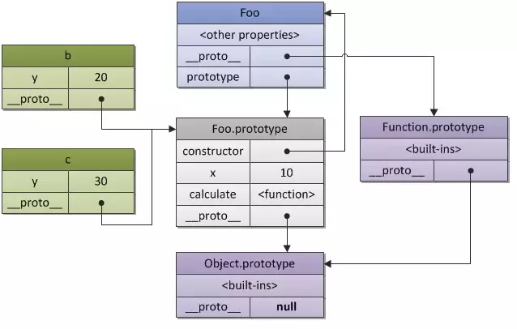

# 原型链

每个对象都可以有一个原型_proto_，这个原型还可以有它自己的原型，以此类推，形成一个原型链。  
按照JS引擎的分析方式，在访问一个实例的属性的时候，现在实例本身中找，如果没找到就去它的原型中找，还没找到就再往上找，直到找到。这就是原型链。



**prototype**  
prototype属性，它是函数所独有的，它是从一个函数指向一个对象。它的含义是函数的原型对象，也就是这个函数（其实所有函数都可以作为构造函数）所创建的实例的原型对象; 这个属性是一个指针，指向一个对象，这个对象的用途就是包含所有实例共享的属性和方法（我们把这个对象叫做原型对象）。

**`__proto__`**  
`__proto__`是原型链查询中实际用到的，它总是指向 prototype，换句话说就是指向构造函数的原型对象，它是对象独有的。

> **在原型链中的指向是**  
> **函数 → 构造函数 → Function.prototype → Object.protype → null**

**constructor**  
每个函数都有一个原型对象，该原型对象有一个constructor属性，指向创建对象的函数本身。  
此外，我们还可以使用constructor属性，所有的实例对象都可以访问constructor属性，constructor属性是创建实例对象的函数的引用。我们可以使用constructor属性验证实例的原型类型（与操作符instanceof非常类似）。

**结论**

* `__proto__` 是原型链查询中实际用到的，它总是指向 prototype；
* prototype 是函数所独有的，在定义构造函数时自动创建，它总是被 `__proto__` 所指。

所有对象都有**proto**属性，函数这个特殊对象除了具有**proto**属性，还有特有的原型属性prototype。prototype对象默认有两个属性，constructor属性和**proto**属性。prototype属性可以给函数和对象添加可共享（继承）的方法、属性，而**proto**是查找某函数或对象的原型链方式。constructor，这个属性包含了一个指针，指回原构造函数。

原型链可以解决重复创建的问题  
使用构造函数创建的每一个对象都会重复创建构造函数中的方法，重复创建了大量公有的方法。所以，我们才要用原型，将公共的方法添加到原型中，这样所有创建的对象都可以共用，而不必重复创建。

## new 操作符

new 运算符创建一个用户定义的对象类型的实例或具有构造函数的内置对象的实例

* 创建一个空的简单JavaScript对象,即{}
* 链接该对象（即设置该对象的构造函数）到另一个对象
* 将步骤1新创建的对象作为this的上下文
* 如果该函数没有返回对象，则返回this

```javascript
function Mother(lastName){
    this.name = lastName;
}
var son = new Mother("Da");
```

上面这段代码对应new操作的4步分别是

* 创建一个新对象  

  `son`

* 新对象会被执行\[\[prototype\]\]链接  

  `son.__proto__ = Mother.prototype`

* 将新对象和函数调用的this绑定起来，执行构造函数中的代码  

  `Mother.call(son, "Da")`

* 如果该函数没有返回对象，则返回this  

  `return this`

## bind/call/apply

call\(\) 、apply\(\)可以看作是某个对象的方法，通过调用方法的形式来间接调用函数。bind\(\) 就是将某个函数绑定到某个对象上。

call\(\)和apply\(\)的区别就在于，两者之间的参数。  
call\(\)在第一个参数之后的 后续所有参数就是传入该函数的值。  
apply\(\) 只有两个参数，第一个是对象，第二个是数组，这个数组就是该函数的参数  
bind\(\) 方法会返回执行上下文被改变的函数而不会立即执行，而前两者是直接执行该函数。他的参数和call\(\)相同

这三个方法的作用都是改变函数的执行上下文  
改变this

## 深浅拷贝

**基本数据类型保存在栈内存，引用类型保存在堆内存中**

根本原因在于保存在栈内存的必须是**大小固定**的数据，引用类型的大小不固定，只能保存在堆内存中，但是可以把它的地址写在栈内存中以供我们访问

* 如果是基本数据类型，则按值访问，操作的就是变量保存的**值** 
* 如果是引用类型的值，我们只是通过保存在变量中的引用类型的**地址**来操作实际对象  

基本类型的复制

赋值的时候，在栈内存中重新开辟内存，存放新的变量，所以在栈内存中分别存放着新老变量各自的值，修改时互不影响

引用类型的复制

指向堆内存中同一地址的同一对象，复制的只是引用地址

* 浅拷贝指复制指向某个对象的指针，而不复制对象本身，新旧对象还是共享同一块内存  
* 深拷贝会另外创造一个一模一样的对象，新对象跟原对象不共享内存，修改新对象不会改到原对象

